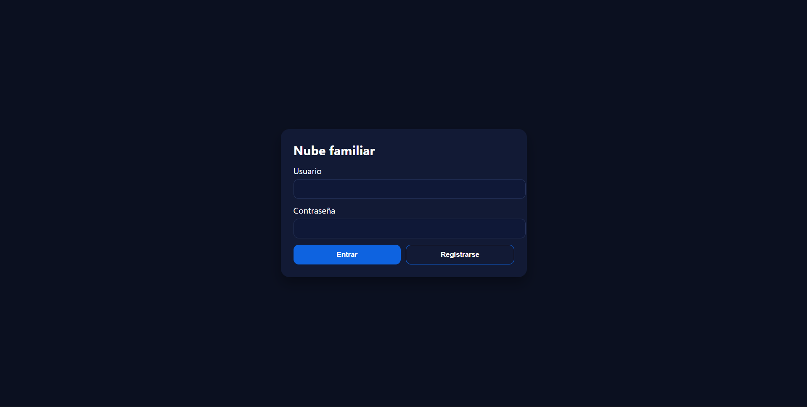
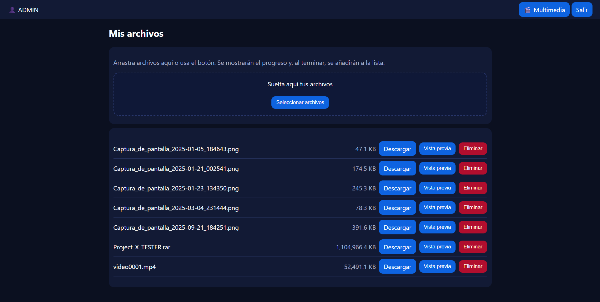

# Nube + Multimedia Privada (tipo “Netflix” casero)

Proyecto PHP para montar una **nube multiusuario** con carpetas privadas por usuario y un apartado **Multimedia compartido** (carátulas + lista de episodios), pensado para XAMPP/Apache en Windows (también funciona en Linux/macOS).
Es ideal si teneis alguna máquina antigua o en desuso y teneis la posibilidad de montar un servidor. Podeis usarlo en familia y tener una plataforma de streaming privada para vosotros con las peliculas y series que os gusten o simplemente para guardar vuestras fotos videos o archivos importantes que necesiteis acceder a ellos a distancia 😉😉

## ✨ Características
- Login/registro con `password_hash()`.
- Carpeta privada: `files/<usuario>/`.
- Subida/descarga segura + **vista previa** (imágenes, vídeo, audio, PDF, texto/JSON).
- Multimedia compartida: `files/video/<Carpeta>/portada.jpg` + `*.mp4` (+ subtítulos `.srt`).
- Reproductor con lista de episodios.
- **Asistente de configuración** (`setup.php`) que escribe `config.php`.
- Auto-crea la BD y la tabla `usuarios` si no existen.

## 🧰 Requisitos
- Apache + PHP 8.x (XAMPP recomendado)
- MySQL/MariaDB
- Extensión `fileinfo` activa
- Permisos de escritura en `files/`

## 🚀 Instalación rápida
1. Copia la carpeta del proyecto en `htdocs` (p. ej. `C:\xampp\htdocs\myservidor`).
2. Abre `http://localhost/myservidor/setup.php` y guarda la configuración (genera `config.php`).
3. Entra en `http://localhost/myservidor/` → regístrate (si está permitido) y accede.

## Estructura
```
myservidor/
  index.php         # Login/registro
  dashboard.php     # Nube privada con vista previa
  multimedia.php    # Grid de carátulas
  player.php        # Reproductor con lista de episodios
  browse.php        # API de listado (opcional)
  download.php      # Descarga/inline con soporte Range
  logout.php
  helpers.php
  config.php        
  setup.php
  files/
    video/
      SerieDemo/
        portada.jpg
        episodio1.mp4
  sql/
    schema.sql
  .htaccess         # sin listado y tipos de vídeo
  files/.htaccess   # bloquea ejecución PHP en files/
```

## 🔒 Seguridad
- Desactivar registro: editar `config.php` (constante `ALLOW_REGISTRATION=false`) o usar `setup.php`.
- `.htaccess` en raíz y en `files/` (sin listado y sin PHP ejecutable en `files`).
- `download.php` con `nosniff` y CSP básica.
- Rutas saneadas con `safeJoin()`; formularios sensibles con **CSRF**.
- Se libera el bloqueo de sesión para streaming con `session_write_close()`.

## 📸 Capturas




## 👤 Autor
**[morjoos-dev](https://github.com/morjoos-dev)**

## 📜 Licencia
MIT
---
